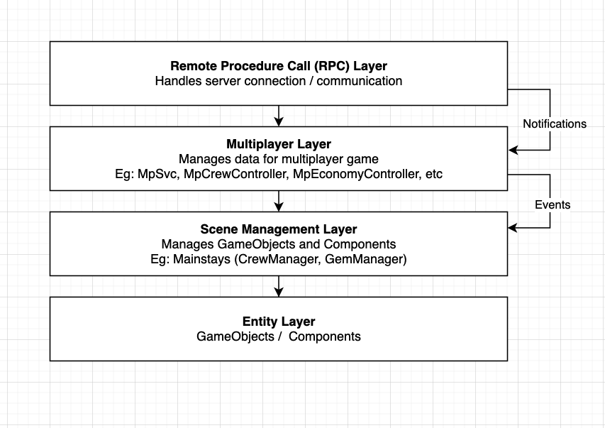

# 2023
## Dec 28, 3:35pm

First .plan entry on Github. I've maintained a .plan file for a few months now but much of the information is private. I've decided to start a public .plan file to keep track of my progress, help stay motivated, and share the progress of my projects (currently, mainly, Slipstream) with the community.

Most of my .plan writing is stream of consciousness. However, when I am working on a particularly nebulous problem, it helps to write about it more coherently so that I can really wrap my head around it. Today is one of those days:

Today I am continuing work to reorganize our database's datascheme so that it is easier to perform bulk operations on. To do that, I needed to rip out our previous Object Document Mapping (ODM) layer (Typesaurus). Typesaurus hasn't provided much benefit and has in fact hidden some functionality of Firestore.

Firestore's default library is not much better however, so I had to write my own ORM, or ODM, or whatever, to make it easier to work with. Right now its called DocumentProxy, following the naming conventions of Firestore (DocumentReference, DocumentSnapshot, etc). It is not currently following the ActiveRecord design pattern, but I think it should eventually.

The feature that spurred this reorg / refactor is the ability to reward players with XP periodically, outside of battle. The challenges that I faced were:

1. The Firestore API does not support batch-updating across multiple subcollections.

    You can only do batch updates to subcollections on one parent collection.

2. The Firestore client SDK does not provide a way to store data changes in memory.

    You can make data changes to the DB, but then you can't modify the data mapping. So if you want to reserialize a record after you've changed it, you need to fetch it again from the DB. This is by design, and there are reasons for it, but Typesaurus did this and worked fine. So I'm creating a lighter-weight ODM layer similar to Typesaurus, but does not hide the underlying Firestore SDK data.

The reorg / refactor is working locally as far as I can tell. My biggest concerns are:

1. Data integrity

    The Firestore client SDK's set and update methods by default will delete any keys that exist in the DB but aren't included in the payload. In most cases today, I think this is not what I want. But I may have missed or misunderstood the behavior in some parts. So I have to test and make sure that data doesn't randomly go missing.

2. Faults

    The Firestore client SDK's default behavior when a transaction fails is to throw an error. In the Slipstream game and auth servers, these errors must be caught and recovered from. But I must make sure that I've caught all of these instances and that the recovery behavior is well defined.

Aside from the data access layer, I also have some concerns for the feature I'm working on (periodic XP rewards)

3. Recovery

    Ensure that if an XP grant fails, the game server retries granting that same XP so that the player gets their reward eventually.

4. No "double-spend"

    XP received in game should never be rewarded to a player more than once. However, I don't want this to come at the cost of not rewarding players for legitimate XP. So, if it comes to this vs "Recovery", I would favor Recovery.

5. No overlap of reward systems

    There is already a system in the game-servers to reward players with XP after a battle ends. This is not done in bulk, but rather as separate transactions done 1-by-1 asynchronously. I must ensure that XP awarded out of battle does not get counted toward the in-battle reward system. And this must also be true if a reward attempt has failed and is pending retry.

Next steps:

1. Continue testing data reorganization and integrity.
2. Ensure out-of-battle rewards still function as expected
3. Continue working on PendingProgressionRewards system
4. Refactor PostBattleProgressionRewardsProcessor to work with the new batching API, and ensure it can recover from failures

## Dec 29, 3:51pm

Noticed an issue where RPCClient was not properly cleaning up its notification subscriptions when disposed. This caused the client to request all static data N times, where N was the number of times the user re-authenticated per session. It didn't seem to have any side effects, but its resolved.

Back to testing the integrity post-reorg. My plan is to deploy this and migrate data tonight, commandeer Eric and Alfredo to help do regression testing, then continue work on out-of-battle XP once the dust has settled.

## Dec 29, 4:44pm

I'm going to take a break from regression testing and focus on shoring up the new usage of Firestore client SDK. Will be testing:

1. When set/update/add/delete methods throw, errors are caught elegantly and game server continues functioning
2. Make sure Firestore client SDK has built in retries when a failure happens. This was happening before (as evidenced by my logs), but I'm not sure it was provided by Typesaurus or the underlying SDK. Hoping it's built into the SDK

Now how do I turn on those internal logs again...

--

Here's what I found: It's possible that the DB client has a built-in retry w/ debounce. The *functions* client does not. Previously, I manually added a debounce for every function call. I've now refactored ServiceFunctionClient to include the debounce by default, and hidden the internals of that in ServiceFunctionClientInternal. ServiceFunctionClient will be used for adding / remove / interacting with functions in the future. All internals are abstracted away.

Also, it looks like these are the services that get called from the client:
  1. checkIn (apps/game/src/App.ts)
  2. gameSessionUpdate (apps/game/src/game-lift/GameLiftBootstrapper.ts)
  3. grantCrewmatePostBattleWinnings (apps/game/src/battle/battle-results/PostBattleProgressionRewardsProcessor.ts)
  4. grantCrewmatePostCampaignWinnings (apps/game/src/campaigns/campaign-results/PostCampaignProgressionRewardsProcessor.ts)

6pm - Weekly Demos meeting:

TODO: ShipTechLevelChanged Notif should include latest gem economy changes so that in-ship gem display counters can decrement when tech is upgraded.

9:37pm

Regression test looks good. Good enough for deploy + data migration. Merging this work into main and deploying

- [x] Deploy new code - Success
- [x] Run migrations dry run (`npm run migrations:production:migrate:dry`) - Success set:782 deleted:782
- [x] Run migrations dry production (`npm run migrations:production:migrate:commit`) - Success? set:782 deleted:782
- [x] Redeploy auth and dev1 game servers

Everything seems to have gone fine. However, I've just learned that Retool cannot do "complex" queries like finding a record by a reference's value. So you can't do like, `SELECT * FROM crew WHERE user = "users/abc123"`.

TODO: Redeploy to Gamelift

Notice a problem in the prod Auth server. Apparently Firestore uses Timestamp objects instead of Date objects. And elsewhere in the auth code I saw POJSOs that looked like `{ "_seconds": 999, "_nanoseconds": 999 }`. Not sure in which situation these timestamps are numbers, string, Dates, Timestamps, or generic objects, but I wrote a helper to convert them. I should really narrow that down to avoid data corruption

# 2024
## Jan 3, 1:19pm

Been quietly working on tests for the BackgroundProgressionRewardManager. I've got some basic tests there that don't test the worst edge cases, but give me reasonable confidence in it. Now I'm writing tests for the Firebase functions side of things - `getPartialForCrewmateXpGrant` now, and later `serviceGrantMultipleCrewmatesXpHandler`

Randomly thought of a way to express my thoughts on styling for comments:

1. Single-line comments should not go past the 100 character column
2. Multi-line comments should not go past the 80 character column

Examples:

```
                                                              80 char column \                     / 100 char column
                                                                              |                   |
# INCORRECT:                                                                  |                   |
# This is a line that is longer than 80 chars but the resulting new line looks|                   |
# weird                                                                       |                   |
                                                                              |                   |
# Correct:                                                                    |                   |
# This is a line that is longer than 80 chars but the resulting new line looks weird              |
                                                                              |                   |
# INCORRECT                                                                   |                   |
# Lorem ipsum dolor sit amet, consectetur adipiscing elit. Nulla euismod, nisl eget aliquam ultricies, nunc nisl ultricies nunc, quis aliquam ni
                                                                              |                   |
# INCORRECT                                                                   |                   |
# Lorem ipsum dolor sit amet, consectetur adipiscing elit. Nulla euismod, nisl eget aliquam ultricies
                                                                              |                   |
# Correct                                                                     |                   |
# Lorem ipsum dolor sit amet, consectetur adipiscing elit. Nulla euismod, nisl|                   |
# eget aliquam ultricies                                                      |                   |
                                                                              |                   |
# INCORRECT                                                                   |                   |
# Lorem ipsum dolor sit amet, consectetur adipiscing elit. Nulla euismod, nisl eget aliquam       |
# ultricies, nunc nisl ultricies nunc, quis aliquam ni                        |                   |
                                                                              |                   |
# Correct                                                                     |                   |
# Lorem ipsum dolor sit amet, consectetur adipiscing elit. Nulla euismod, nisl|                   |
# eget aliquam ultricies, nunc nisl ultricies nunc, quis aliquam ni           |                   |
```

This is such a stupid thing to be thinking about. I've just always felt like some comments (and code) are okay to go past the agreed upon column limit if the resulting line break actually makes the comment / code less readable. A few dangling words on a line of their own are distracting imo

Back to work.

3:24pm

Tests done. Now to test manually. But there's a 3:30 planning meeting coming up first

Planning meeting notes:
 - Apple signin is the next big ticket item for me

Back to manually testing. So far I discovered one bug where XP rewards are successfully granted, but the game server fails to parse the response correctly. In that case, the rewards stay in the processing queue and get granted once again. This isn't an issue if the function server + game server agree on the successful response data's shape, but in the odd event that they don't, I want to handle this case.

11:10pm

Background XP rewards are officially working end-to-end locally. The client receives a notif any time XP goes up, and animated the hud accordingly. As well as renders level changes and the skill points available UI when a level up occurs. One bug - The dialog where one would spend skill points doesn't actually show any as available when it loads. How this is possible, I do not know...

## Jan 4, 10:37am

Finished Background XP rewards end-to-end. Merged, deployed. Eric tested a bit, no major bugs. Today I will do a bit more cleanup, and do more testing around downtime / network issues. Then I would like to refactor `PostBattleProgressionRewardsProcessor` to work in batches. Oh, and I broke `cheatGrantCrewmateXpHandler`, or at least the way the client uses it. Will fix that.

This morning I made a diagram to help communicate the game's front-end architecture a bit more. 1. Because Alfredo will do some of the work for simulating a game-server locally (more on that later), and 2. Because in one of his PR's I noticed some concern-crossing. I was able to easily spot the concern-crossing and needed to explain how others would be able to do it. Hence this diagram:



Back to work.

# 1:45pm

TODO: Investigate speeding up CloudDBClient#GetDocById. Could append .json to URL to let DB do JSON conversion for me (so client doesn't have to)

Currently creating some automation for my test suite. Automatic user and service-account signin. Using a new tool, Insomniac - a replacement for Postman. Pretty good so far.

Using Insomniac, I set up an Environment (Slipstream Local) that automatically logs in as a user or service-account. I created to demo endpoints - serviceGetCrewByUserId and cheatGrantCrewmateXp. For former signs in as the service-account. The latter signs in as whatever user is in the environment field `twitchUserName`. Very cool

Back to fixing `cheatGrantCrewmateXpHandler` - I fixed that locally. It was a client-side issue. I should be able to connect to dev1 now and try again without needing to deploy new code to firebase prod or dev1.

Yup, that worked. Committing.

# Jan 5, 3:51pm

Demos meeting. Group testing background XP rewards. Looks good except there's a good amount of floating point precision error. Would be great to get that fixed but Eric's not too worried.

Found a bug where skill points that were available go missing (on the client). Database seems correct but the client is overwriting the value with something that's cached or something.

Also the score multiplier is wrong. It should be .05 of the score for the particular stat. The multiplier is BattleRewardsConstants.BattleScoreXpRatio. Fixed

--

Yesterday I started working on Apple Signin. Managed to get a development build to work with Apple Signin entitlement, added the open-source Unity Apple Signin framework to the game, and was able to generate an Apple JWT. Now I've got to deliver that JWT to the auth server at a yet-to-be created endpoint. Create a generic account (with randomly generated name I guess)

# Jan 8, 3:15pm

Before continuing work on Apple Signin today, I looked into upgrading our server stack to Node18. Firebase is dropping support for Node16 (Released on Oct 20, 2020. LTS version Apr 20, 2021), but Amazon Linux 2 on GameLift only supports Node16. It looks like Amazon Linux 2023 supports Node18 (Released Apr 20, 2022. Via the dnf package manager). So I believe I'll be able to upgrade Firebase and GameLift to Node 18. I guess Node 20 (Released Apr 19, 2023) is too much to ask for?